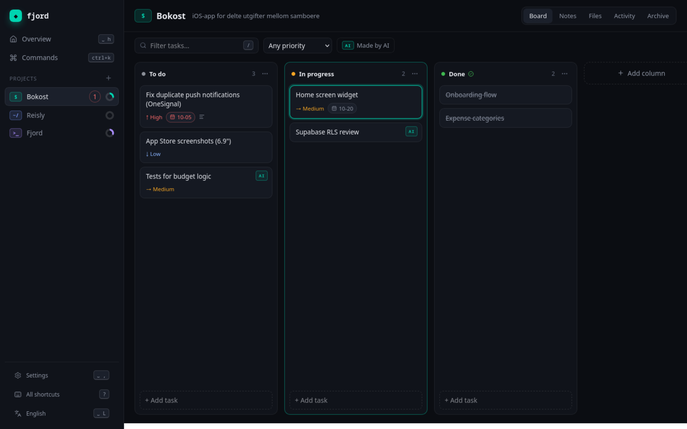
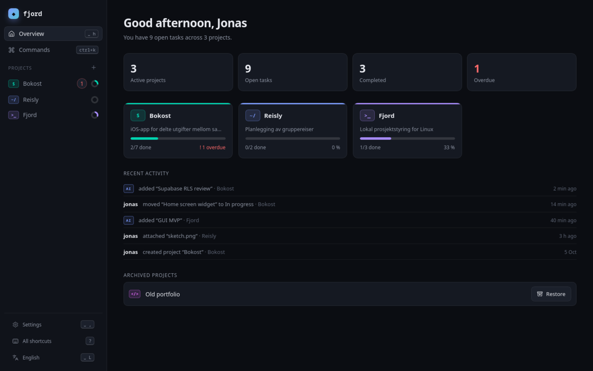
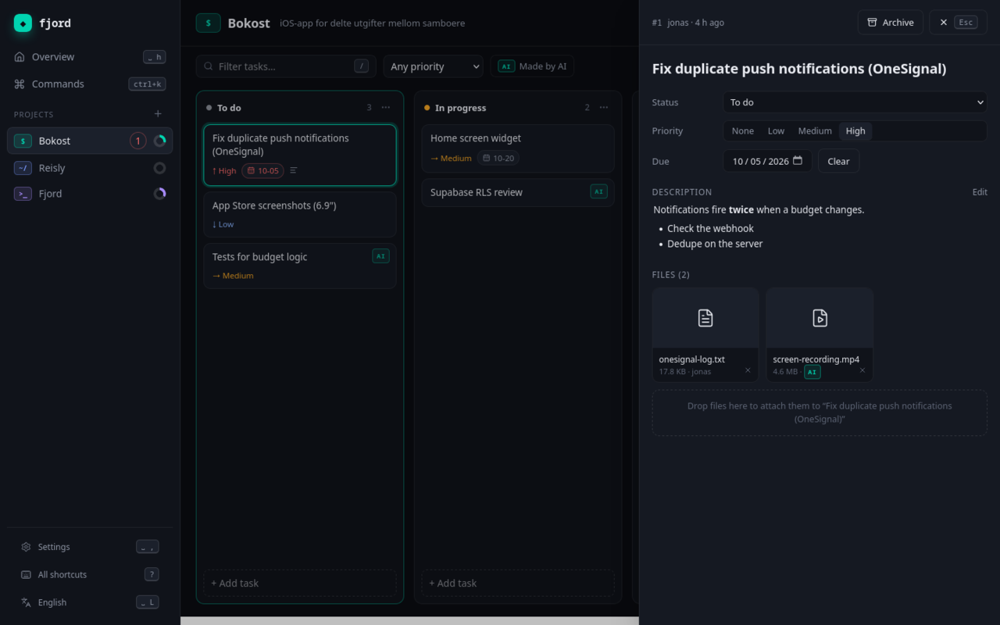
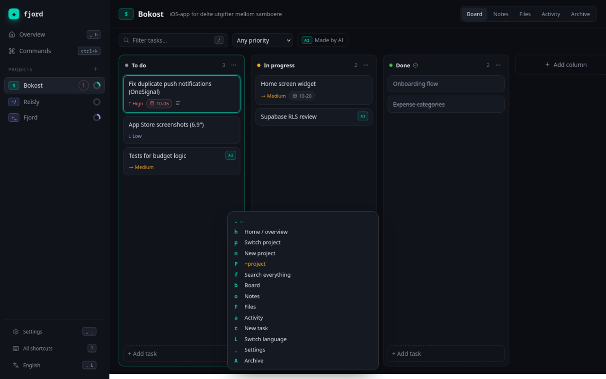
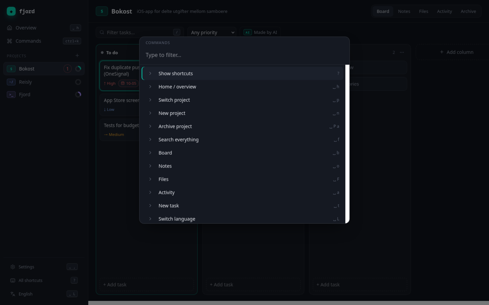
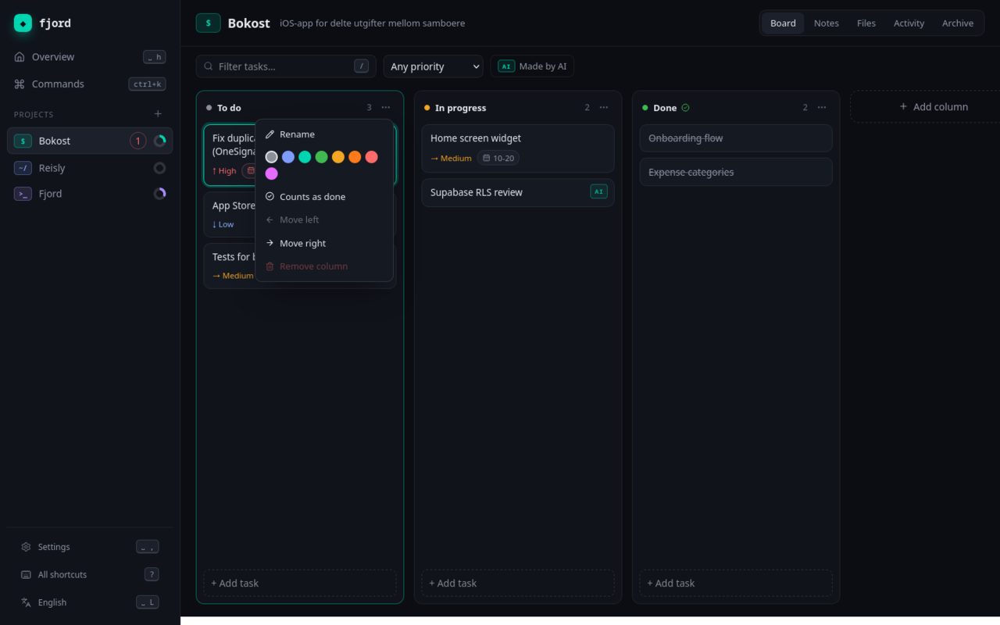
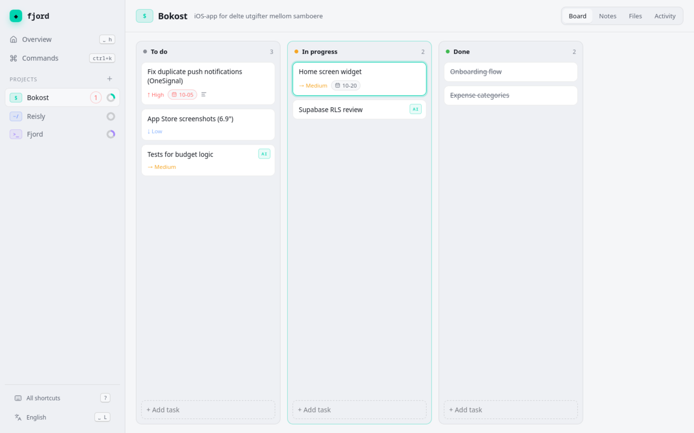

<div align="center">

```
  /\    /\
 /  \  /  \
/    \/    \  fjord
```

**Local-first project management for Linux — built for the keyboard, friendly to the mouse, and open to AI agents.**

[](https://github.com/jhtjernsmo/fjord/actions/workflows/ci.yml)




</div>

Fjord keeps your projects, kanban boards, files and notes in a single SQLite database on your own
machine. No account, no cloud, no telemetry. It's a lightweight native desktop app (Tauri), a scriptable
CLI, and an [MCP](https://modelcontextprotocol.io) server — so you and your AI assistant can work in
the same projects, and you can always see who did what.

## Features

- **Projects & kanban boards** — drag and drop, or move tasks with `H`/`L`. Rename, recolor, reorder and add columns.
- **Tasks** — markdown descriptions, priority, due dates, overdue warnings, archive & restore.
- **Files** — drop files onto the window to attach them to a project or task. Stored content-addressed (deduplicated) with image previews.
- **Notes** — markdown notes per project.
- **Full-text search** across tasks, notes and file names (`Space f`).
- **Keyboard-first, LazyVim-style** — a leader key with a which-key popup, vim motions on the board, a `Ctrl+K` command palette, and every binding configurable. The mouse works for everything too.
- **AI-agent ready** — `fjord mcp` exposes 12 tools to MCP clients such as Claude. Agents can create, edit, move and archive but never hard-delete, and every change is tagged with its author.
- **Activity log** — what changed, when, and by whom (you or an agent).
- **Live updates** — changes from the CLI or an agent appear in the open app within a second or two.
- **English and Norwegian** — English by default; adding a language is one file.
- **Dark and light themes** — follows your system, or pick one in Settings.

<table>
  <tr>
    <td></td>
    <td></td>
  </tr>
  <tr>
    <td></td>
    <td></td>
  </tr>
  <tr>
    <td></td>
    <td></td>
  </tr>
</table>

## Install

Fjord is an early preview; there are no packaged releases yet. Build it from source:

**Requirements:** Rust (stable), Node.js 20+, and WebKitGTK 4.1.

```sh
# Arch
sudo pacman -S --needed webkit2gtk-4.1 base-devel
# Debian / Ubuntu
sudo apt install libwebkit2gtk-4.1-dev build-essential libssl-dev librsvg2-dev
# Fedora
sudo dnf install webkit2gtk4.1-devel openssl-devel librsvg2-devel
```

```sh
git clone https://github.com/jhtjernsmo/fjord.git
cd fjord
npm --prefix ui install
npx --prefix ui tauri build --bundles deb   # release build + .deb in target/release/bundle
./target/release/fjord-app           # run it

cargo install --path crates/fjord-cli  # optional: puts `fjord` on your PATH
```

For development with hot reload: `npx --prefix ui tauri dev`.

## Keyboard

Press `?` in the app to see every shortcut. Press the leader key (`Space`) and wait a moment to see
what comes next.

| Keys | Action | Keys | Action |
|---|---|---|---|
| `Ctrl+K` | Command palette | `h` `j` `k` `l` | Move around the board |
| `Space p` | Switch project | `H` / `L` | Move task to previous/next column |
| `Space t` | New task | `J` / `K` | Move task down/up |
| `Space f` | Search everything | `Enter` | Open task |
| `Space n` | New project | `o` | New task in this column |
| `Space b` `o` `F` `a` `A` | Board, notes, files, activity, archive | `x` | Toggle done |
| `Space ,` | Settings | `d d` | Archive task |
| `Space L` | Switch language | `p` | Cycle priority |
| `Esc` | Close | `/` | Filter the board |

Remap anything in `~/.config/fjord/keymap.json`:

```json
{
  "leader": "space",
  "bindings": {
    "task.archive": "D",
    "search.open": "<leader>/"
  }
}
```

Action ids are listed in [`ui/src/keymap.ts`](ui/src/keymap.ts).

## Command line

```sh
fjord project add "Bokost" --icon '$'
fjord task add bokost "Fix push notifications" -p 3 --due 2026-10-10
fjord column add bokost Review
fjord task move 1 review
fjord task done 1
fjord project show bokost          # board in the terminal
fjord search push
fjord log bokost                   # activity
fjord --json project ls            # JSON for scripts
```

Run `fjord --help` for everything. Changes are recorded with an actor: `--actor`, `$FJORD_ACTOR` or `$USER`.

## AI agents (MCP)

`fjord mcp` runs a [Model Context Protocol](https://modelcontextprotocol.io) server on stdio. Changes it
makes are recorded as `claude` (override with `--actor`) and shown with an **AI** tag in the app.

With Claude Code:

```sh
claude mcp add fjord -- fjord mcp
```

Other clients:

```json
{ "mcpServers": { "fjord": { "command": "fjord", "args": ["mcp"] } } }
```

Tools: `list_projects`, `get_board`, `create_project`, `create_task`, `update_task`, `move_task`,
`complete_task`, `archive_task`, `add_note`, `attach_file`, `search`, `recent_activity`. There is
deliberately no delete tool.

## Data

| What | Where |
|---|---|
| Database | `~/.local/share/fjord/fjord.db` (SQLite, WAL) |
| Attached files | `~/.local/share/fjord/files/` (named by SHA-256) |
| Keymap | `~/.config/fjord/keymap.json` |

Set `FJORD_DATA_DIR` to use another location, for example a separate test database. Back up by
copying the folder.

## Architecture

```
crates/fjord-core   Rust library: schema & migrations, projects, columns, tasks, files, notes, search, activity
crates/fjord-cli    `fjord` CLI and MCP server
src-tauri           Tauri desktop shell — thin commands over fjord-core
ui                  React + TypeScript interface (dnd-kit, Lucide, Motion)
```

All three front ends (GUI, CLI, MCP) go through `fjord-core`, so validation and the activity log
behave the same everywhere.

## Development

```sh
cargo test --workspace             # Rust: core unit tests, CLI and MCP end-to-end tests
npm --prefix ui test               # UI: keymap engine, i18n, helpers (Vitest)
cargo clippy --workspace --all-targets -- -D warnings
cargo fmt --all
npm --prefix ui run typecheck
```

See [CONTRIBUTING.md](CONTRIBUTING.md). Translations are welcome: copy the `no` block in
[`ui/src/i18n.ts`](ui/src/i18n.ts).

## Roadmap

- Packaged releases (AppImage, Flatpak, AUR)
- Tags and saved filters
- Desktop notifications for due dates
- Paste images from the clipboard, PDF previews
- Git integration (`fixes #12` closes a task)
- Timeline and calendar views

## License

Licensed under either of [Apache License 2.0](LICENSE-APACHE) or [MIT](LICENSE-MIT), at your option.
